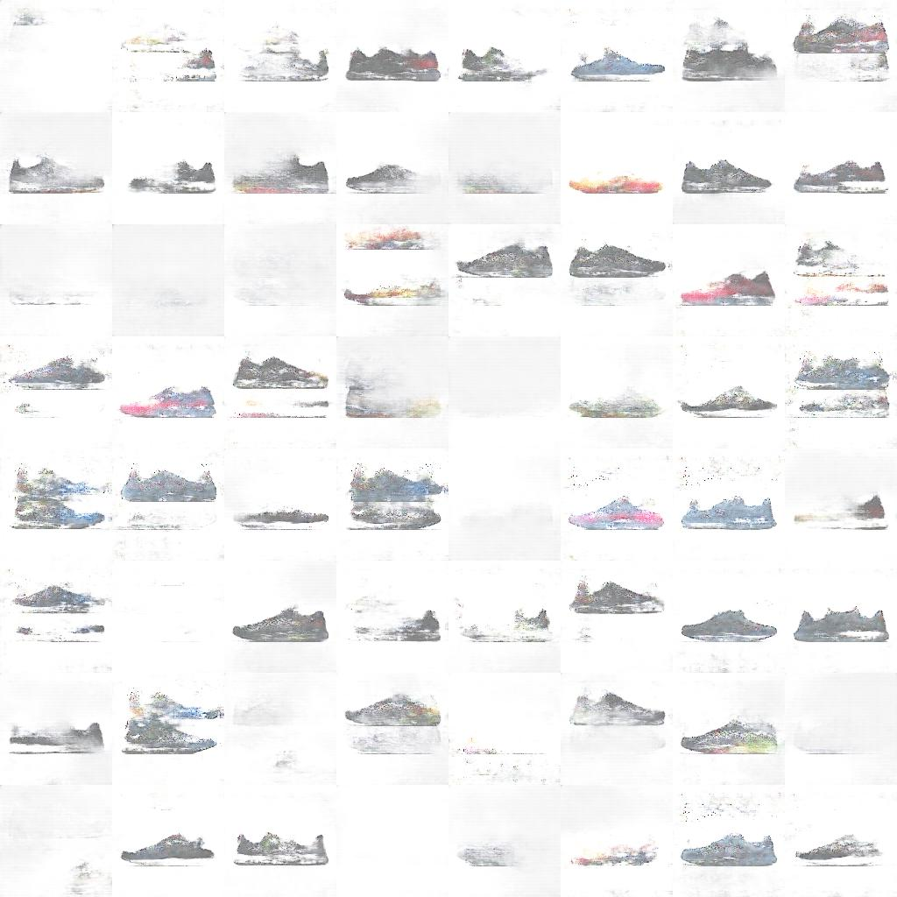

# tenisGAN

Usando redes neuronales, especificamente modelos adversarios generativos(GAN) se crean imagenes de zapatos tenis. con diseños que no existen. 



## Dependencies (pip install) 
```
cv2
tensorflow( >=1.0)
scipy
numpy
```
## Usage
```
cd tenisGAN
python resize.py
python RGBA2RGB.py
python tenisGAN.py
```
